# Perfect Snake Bot

Bot plays a strong game of Snake by following a **Hamiltonian Cycle** and taking shortcuts when it is safe to do so.

Methods used in this project: **Memoization, Divide and Conquer, Union Find, Hamiltonian Cycles, Sliding Window, Backtracking, Pathfinding, and Hybrid Bot Logic**.

More details in [the how it works section](#how-it-works).

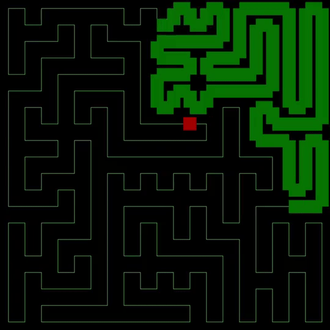

<details>

<summary>Show grid and Hamiltonian Cycle on / off feature (click to show)</summary>

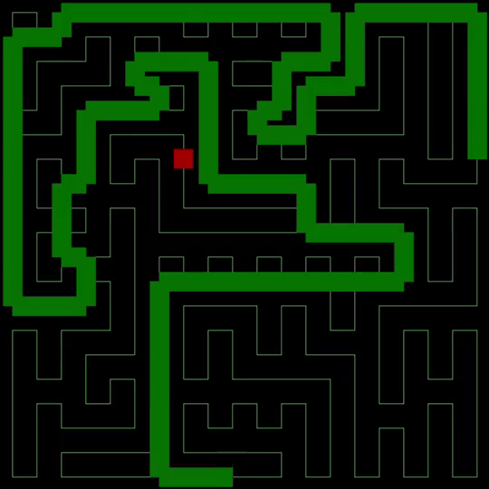

</details>

<details>

<summary>Speed up game to win screen (click to show)</summary>

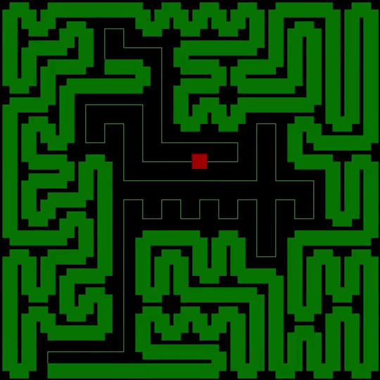

</details>

<details>

<summary>Works with large arrays too (100 x 100) (click to show)</summary>

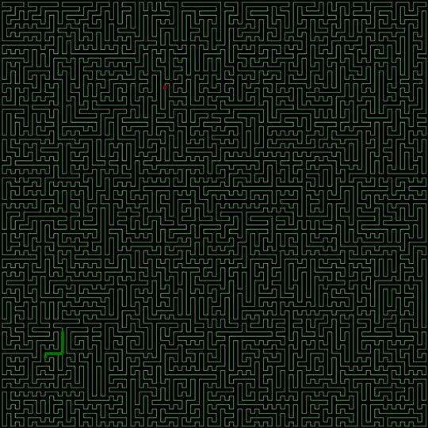

</details>

---

## Usage

1. Adjust `config.py` as desired.
2. Run `game.py`.
3. Use the controls below to compare the different modes.

<details>

<summary>Click to show default config</summary>

```python
config = {
            # =============================================================================
            # WINDOW SETTINGS
            # =============================================================================
            "WIDTH": None,
            "HEIGHT": 1200,
            "BOX_WIDTH": 30,
            
            # =============================================================================
            # GRID SETTINGS
            # =============================================================================
            "C": 40,
            "R": 40,
            "GRID_COLOR": (150, 150, 150),
            "GRID_THICKNESS": 1,
            "SHOW_GRID": False,
            "UPDATE_BACKGROUND": False,
            
            # =============================================================================
            # GAME SPEED SETTINGS
            # =============================================================================
            "SLEEP_TIME": 0.02,
            "LOCK_TIME": 0.2,
            
            # =============================================================================
            # HAMILTONIAN CYCLE SETTINGS            
            # =============================================================================
            "SHUFFLE": True,
            "MAX_SIZE": 6,
            "HAM_COLOR": (100, 200, 100),
            "HAM_WIDTH": 1,
            "SHOW_PATH": True,
            "SHORTCUTS": True,

            # =============================================================================
            # SNAKE AND FOOD SETTINGS
            # =============================================================================
            "SNAKE_WIDTH": 0.8,
            "SNAKE_COLOR": (0, 100, 0), 
            "CENTER_SNAKE": False,
            "SNAKE_LENGTH": 10,
            "FOOD_COLOR": (175, 0, 0),
            }
```

</details>

---

## Controls

- **Esc** — quit the game
- **Up / Down Arrow** — speed up or slow down the game
- **G** — toggle grid visibility
- **H** — toggle Hamiltonian cycle visibility
- **S** — toggle shortcuts (when off, the snake strictly follows the Hamiltonian cycle)

---

## Modes

### 1. Normal / Hybrid Mode
Hamiltonian path is active and shortcuts are **enabled**. This is the main smart mode and usually the best one to watch.

### 2. Strict Hamiltonian Mode
Shortcuts are **disabled**, so the snake follows the Hamiltonian route exactly. Slower but extremely safe and useful for debugging.

### 3. Path Display Mode
Press **H** to show or hide the Hamiltonian cycle. This only changes visualization, not the bot logic.

### 4. Grid Display Mode
Press **G** to show or hide the grid overlay. This is purely visual.

---

## How It Works

The project works in a simple order:

1. Build a **Hamiltonian Cycle** that covers the entire board.
2. Use that cycle as the snake's guaranteed safe path.
3. Evaluate nearby moves that reach the food faster.
4. Take shortcuts only when they are verified to be safe.

**Core idea:** the snake is *safe by default* but becomes faster whenever a safe shortcut exists.

---

## How It Was Made

The process of making the snake bot can be broken down into a few main parts.

<details>

<summary>1. Calculate a Hamiltonian Cycle for a small array</summary>
<br>

Small arrays are solved directly using backtracking. This is used as the base solver for local regions.

Keep in mind that valid full-board Hamiltonian generation works best when the board dimensions are even.

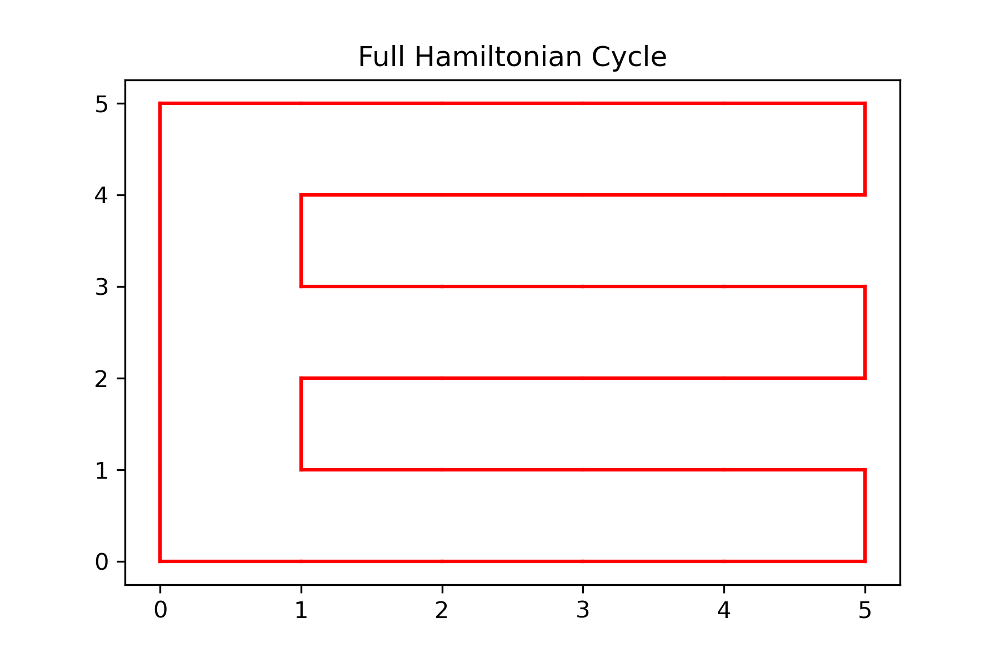
<hr>

</details>

<details>

<summary>2. Subdivide a large array into smaller valid subarrays</summary>
<br>

Because direct Hamiltonian solving does not scale well, the board is broken into smaller manageable regions.

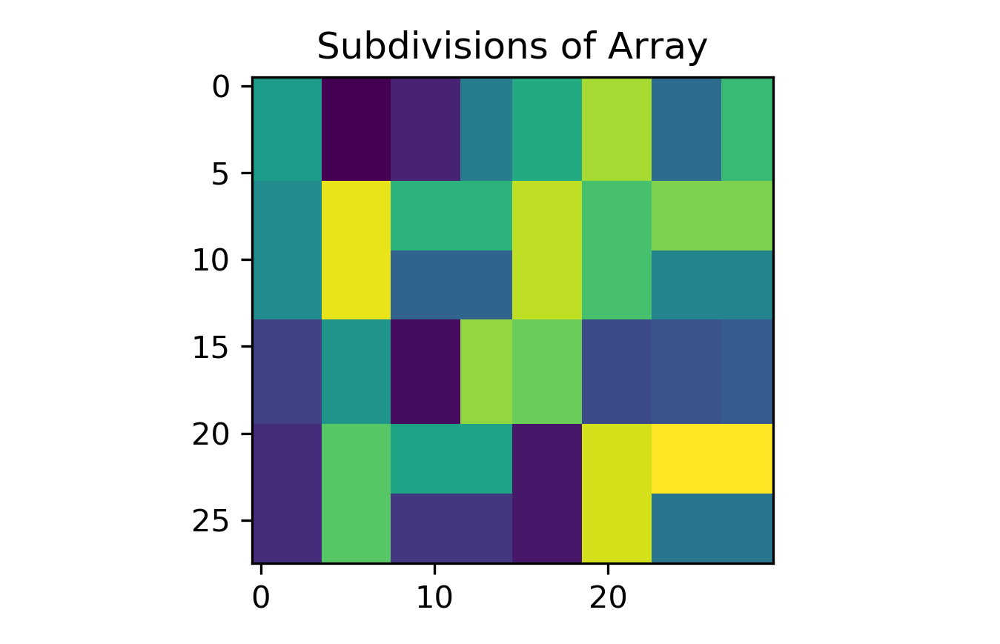
<hr>

</details>

<details>

<summary>3. Solve each subarray and reuse repeated shapes</summary>
<br>

This project uses <b>memoization</b>. If two subregions have the same shape, the same Hamiltonian solution pattern can be reused instead of recomputing it again.

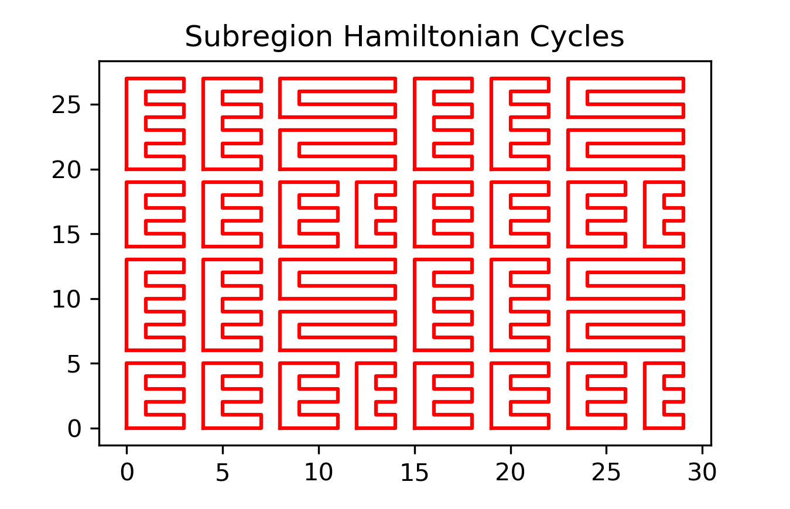
<hr>

</details>

<details>

<summary>4. Merge the subcycles into one large Hamiltonian Cycle</summary>
<br>

The project uses a <b>Union-Find</b> structure and small 2x2 kernels to merge neighboring subcycles into one full-board cycle.

Shuffling kernels and changing max subarray size changes how random or structured the final cycle looks.

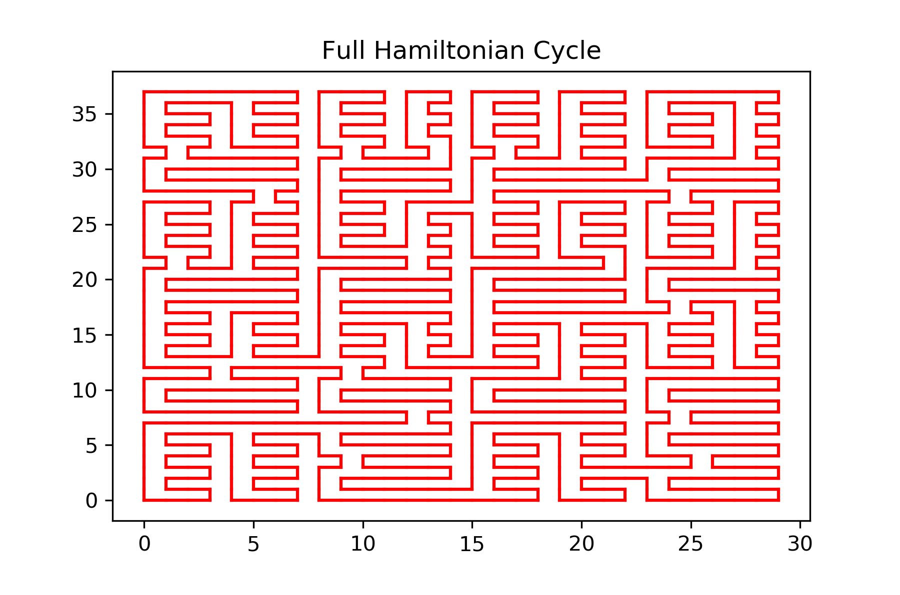
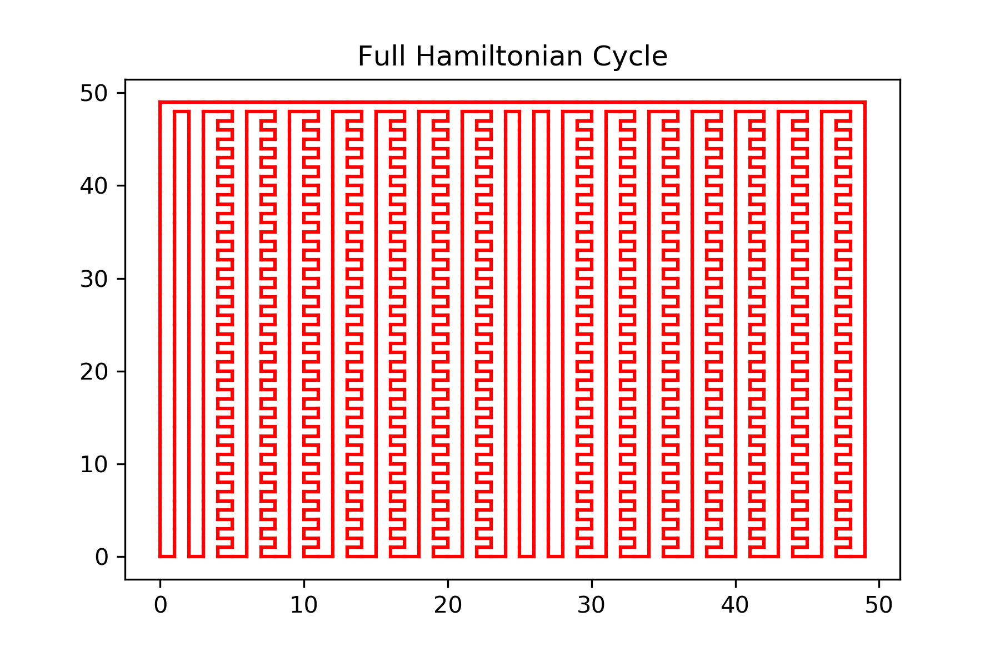
<hr>

</details>

<details>

<summary>5. Convert the Hamiltonian Cycle into a directed graph</summary>
<br>

Once the full cycle is built, it is converted into a directed route so the snake can easily know its next safe move.

<hr>

</details>

<details>

<summary>6. Run the snake game on top of that route</summary>
<br>

The snake follows the Hamiltonian graph by default. Food, growth, movement, rendering, and step logic are handled by the game files.

The snake body is stored efficiently, food is spawned, and each step checks whether a shortcut should be taken.

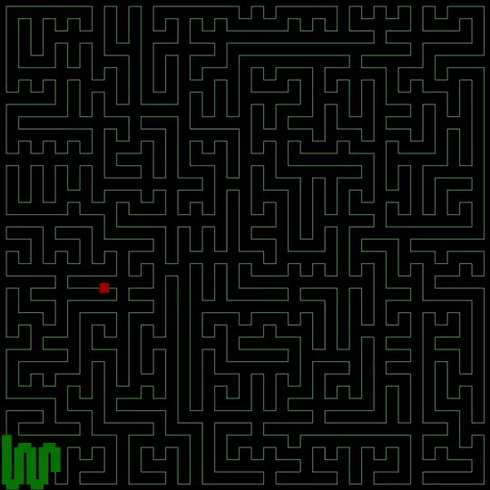
<hr>

</details>

<details>

<summary>7. Detect shortcuts to food and test if they are safe</summary>
<br>

The bot computes which nearby moves reach food faster, then simulates whether leaving the Hamiltonian path is still safe.

If safe, it takes the shortcut. If not, it stays on the normal Hamiltonian route.

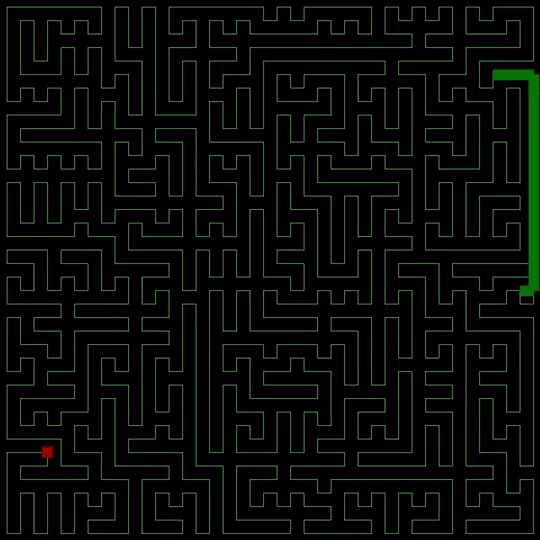
<hr>

</details>

---

## File Structure

```text
snake-bot-lab
├── config.py
├── cycle.py
├── drafts/
│   ├── game_old.py
│   ├── game_try.py
│   ├── ham.py
│   └── path.py
├── game.py
├── graphics/
│   └── logo.png
├── images/
├── README.md
└── requirements.txt
```

---

## Important Things to Remember

- Rows and columns should usually be even.
- Shortcuts **ON** = smarter and faster
- Shortcuts **OFF** = strict Hamiltonian mode
- **H** only changes path visibility
- **G** only changes grid visibility
- Smaller **MAX_SIZE** usually makes the cycle appear more random
- Larger **MAX_SIZE** usually makes the cycle appear more structured

---

## In One Line

Hamiltonian structure guarantees survival, while shortcut logic improves efficiency by reaching food faster whenever it is safe.